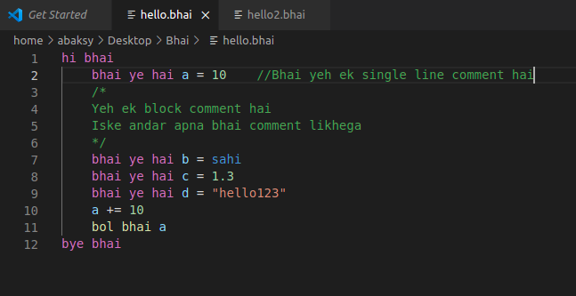

# bhailang README

Syntax highlighting for the esoteric programming language called [BhaiLang](https://github.com/DulLabs/bhai-lang)

## Features

- Syntax Highlighting
- Basic autocomplete

Coming soon: Intellisense and code completion support!

### 0.1.0

Initial release of BhaiLang VS Code extension

